# Introduction

The MEAN stack is a popular JavaScript stack used for building web applications. It stands for MongoDB, Express.js, AngularJS (or Angular), and Node.js. Here's a brief overview of each component:

__MongoDB:__ MongoDB is a NoSQL database that stores data in a flexible, JSON-like format. It is a popular choice for web applications because of its scalability, flexibility, and performance.

__Express.js:__ Express.js is a web application framework for Node.js. It provides a set of features for building web applications and APIs, including routing, middleware support, and templating engines. Express.js simplifies the process of building web applications with Node.js by providing a high-level abstraction over the HTTP protocol.

__AngularJS (or Angular):__ AngularJS is a JavaScript framework maintained by Google for building dynamic web applications. It extends HTML with additional attributes and provides a set of built-in directives for creating interactive user interfaces. AngularJS follows the Model-View-Controller (MVC) architecture, making it easy to organize code and build complex web applications.

__Node.js:__ Node.js is a JavaScript runtime built on Chrome's V8 JavaScript engine. It allows developers to run JavaScript code outside of a web browser, making it possible to build server-side applications with JavaScript. Node.js is known for its event-driven, non-blocking I/O model, which makes it well-suited for building scalable and high-performance web applications.


## Step 0: Prerequisites

__1.__ EC2 Instance of t3.small type and Ubuntu 22.04 LTS (HVM) was lunched in the us-east-1 region using the AWS console.

__2.__ Attached SSH key named __my-ec2-key__ to access the instance on port 22

__3.__ The security group was configured with the following inbound rules:

- Allow traffic on port 80 (HTTP) with source from anywhere on the internet.

- Allow traffic on port 443 (HTTPS) with source from anywhere on the internet.

- Allow traffic on port 22 (SSH) with source from any IP address. This is opened by default.

- Allow traffic on port 5000 (Custom TCP) with source from anywhere.

- Allow traffic on port 3000 (Custom TCP) with source from anywhere.
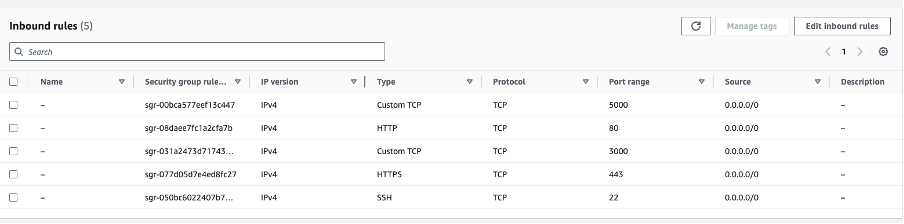
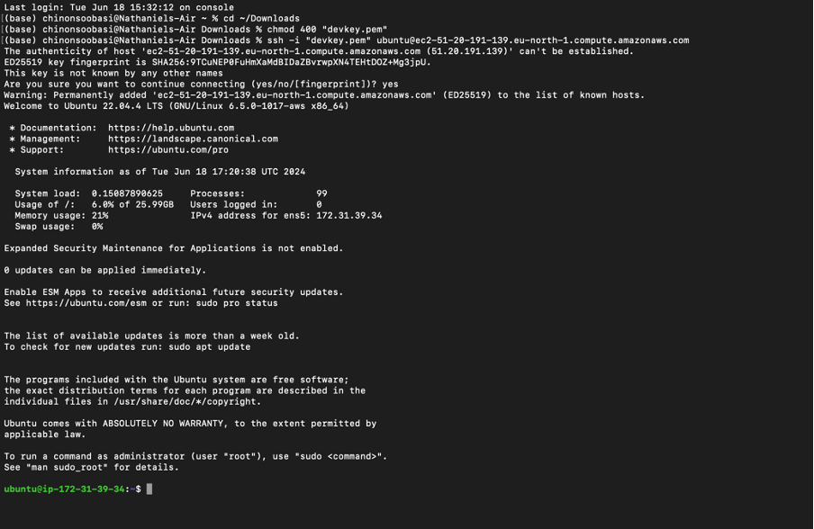


## Step 1 - Install Nodejs

Node.js is a JavaScript runtime built on Chrome’s V8 JavaScript engine. Node.js is used in this tutorial to set up the Express routes and AngularJS controllers.

__1.__ __Update and Upgrade ubuntu__

```bash
sudo apt update && sudo apt upgrade -y
```
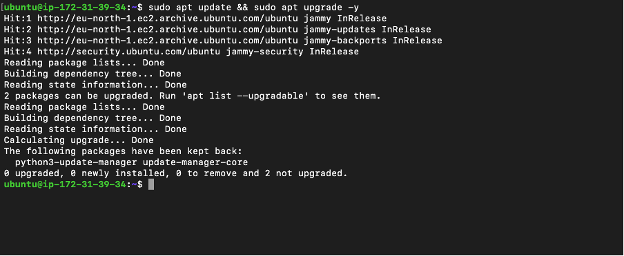

__2.__ __Add certificates__

```bash
sudo apt -y install curl dirmngr apt-transport-https lsb-release ca-certificates
```
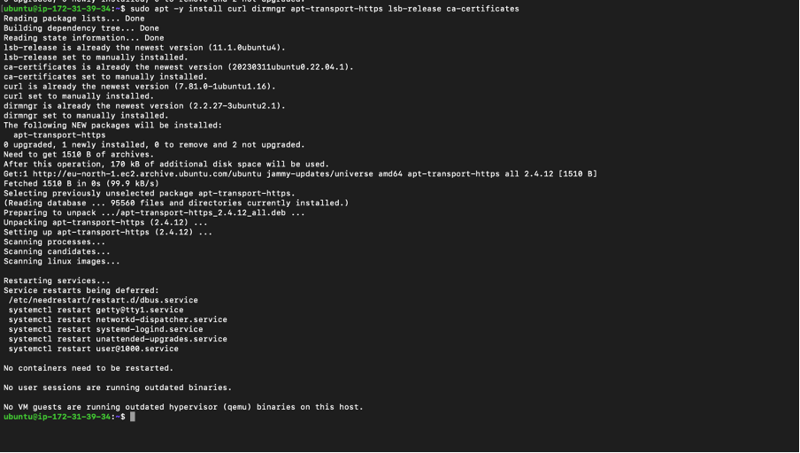


```bash
curl -sL https://deb.nodesource.com/setup_18.x | sudo -E bash -
```
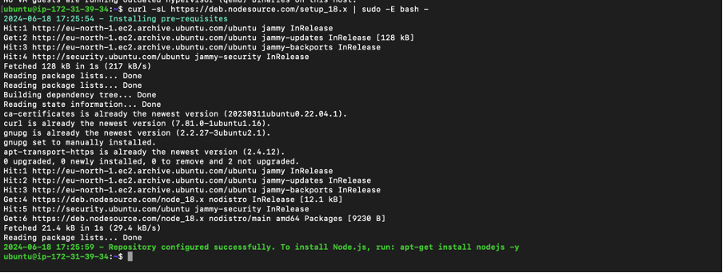

__.3__ __Install NodeJS__

```bash
sudo apt-get install -y nodejs
```
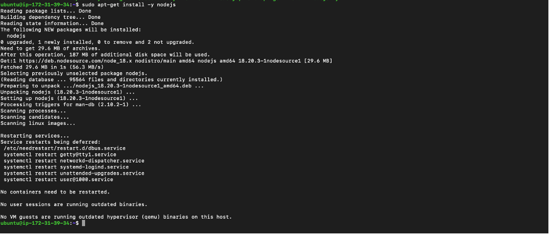


## Step 2 - Install MongoDB

For this application, Book records were added to MongoDB that contain book name, isbn number, author, and number of pages.

__1.__ __Download the MongoDB public GPG key__

```bash
curl -fsSL https://pgp.mongodb.com/server-7.0.asc | sudo gpg --dearmor -o /usr/share/keyrings/mongodb-archive-keyring.gpg

```
Create a list file for MongoDB Create the /etc/apt/sources.list.d/mongodb-org-7.0.list file for Ubuntu 22.04:
```
echo "deb [ arch=amd64,arm64 signed-by=/usr/share/keyrings/mongodb-server-7.0.gpg ] https://repo.mongodb.org/apt/ubuntu jammy/mongodb-org/7.0 multiverse" | sudo tee /etc/apt/sources.list.d/mongodb-org-7.0.list
```

__2.__ __Update the package database and install MongoDB__

```bash
sudo apt-get update

sudo apt-get install -y mongodb-org
```
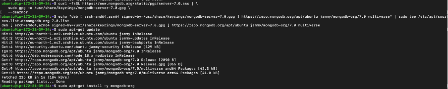
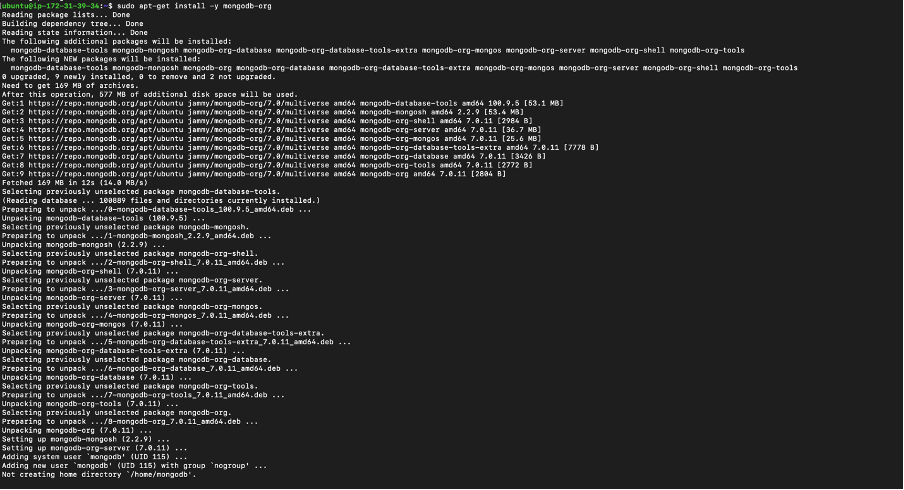


__3.__ __Start and enable MongoDB__

```bash
sudo systemctl start mongod
```
```bash
sudo systemctl enable mongod
```
```bash
sudo systemctl status mongod
```
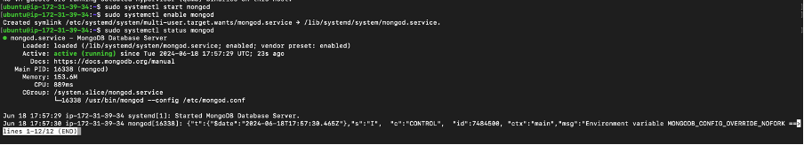

__5.__ __Install body-parser package__

__body-parser__ package is needed to help process JSON files passed in requests to the server.

```bash
sudo npm install body-parser
```
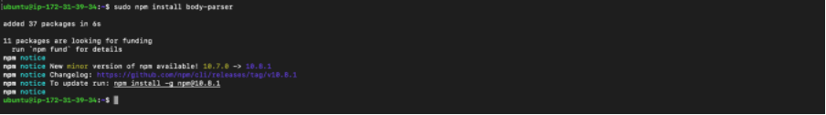

__6.__ __Create the project root folder named ‘Books’__

```bash
mkdir Books && cd Books
```

Initialize the root folder
```bash
npm init
```
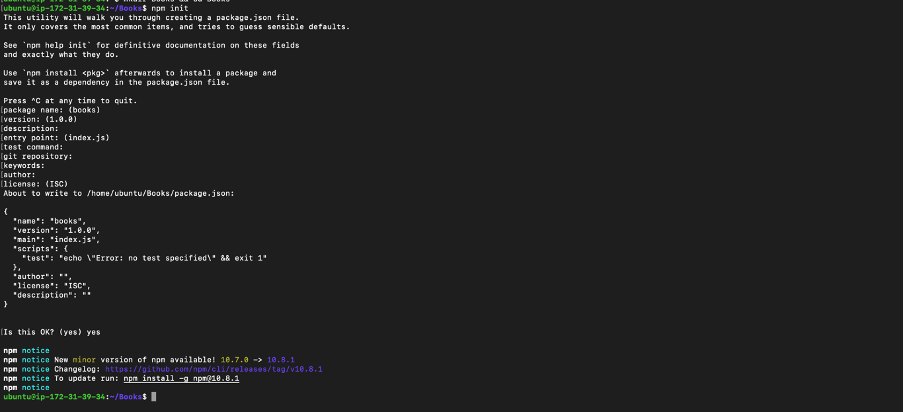

__Add file named server.js to Books folder__
```bash
vim server.js
```
Copy and paste the web server code below into the server.js file.

```bash
const express = require('express');
const bodyParser = require('body-parser');
const mongoose = require('mongoose'); // Make sure mongoose is installed and required
const path = require('path'); // To handle static file serving
const app = express();

// Connect to MongoDB
mongoose.connect('mongodb://localhost:27017/test', { useNewUrlParser: true, useUnifiedTopology: true })
  .then(() => console.log('MongoDB connected'))
  .catch(err => console.error('MongoDB connection error:', err));

// Middleware
app.use(bodyParser.json());
app.use(express.static(path.join(__dirname, 'public')));

// Routes
require('./apps/routes')(app);

// Start the server
app.set('port', 3300);
app.listen(app.get('port'), () => {
  console.log('Server up: http://localhost:' + app.get('port'));
});
```
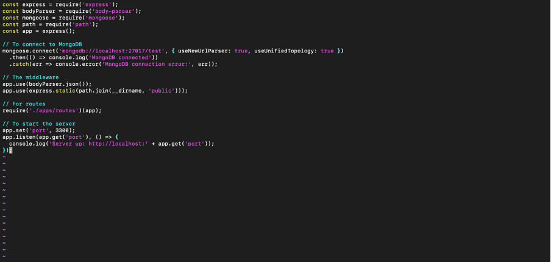


## Step 3 - Install Express and set up routes to the server

Express was used to pass book information to and from our MongoDB database.
Mongoose package provides a straightforward schema-based solution to model the application data. Mongoose was used to establish a schema for the database to store data of the book register.

__1.__ __Install express and mongoose__

```bash
sudo npm install express mongoose
```
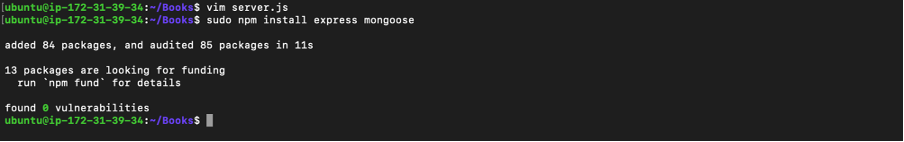

__2.__ __In Books folder, create a folder named ‘apps’__

```bash
mkdir apps && cd apps
```
__In apps, create a file named routes.js__

```bash
vim routes.js
```

Copy and paste the code below into routes.js

```bash
const Book = require('./models/book');
const path = require('path');

module.exports = function(app) {
  // Get all books
  app.get('/book', async (req, res) => {
    try {
      const books = await Book.find({});
      res.json(books);
    } catch (err) {
      console.error(err);
      res.status(500).json({ error: 'Internal Server Error' });
    }
  });

  // Add a new book
  app.post('/book', async (req, res) => {
    try {
      const book = new Book({
        name: req.body.name,
        isbn: req.body.isbn,
        author: req.body.author,
        pages: req.body.pages
      });
      const result = await book.save();
      res.json({
        message: "Successfully added book",
        book: result
      });
    } catch (err) {
      console.error(err);
      res.status(500).json({ error: 'Internal Server Error' });
    }
  });

  // Update a book
  app.put('/book/:isbn', async (req, res) => {
    try {
      const updatedBook = await Book.findOneAndUpdate(
        { isbn: req.params.isbn },
        req.body,
        { new: true }
      );
      if (!updatedBook) {
        return res.status(404).json({ error: 'Book not found' });
      }
      res.json({
        message: "Successfully updated the book",
        book: updatedBook
      });
    } catch (err) {
      console.error(err);
      res.status(500).json({ error: 'Internal Server Error' });
    }
  });

  // Delete a book
  app.delete('/book/:isbn', async (req, res) => {
    try {
      const result = await Book.findOneAndRemove({ isbn: req.params.isbn });
      if (!result) {
        return res.status(404).json({ error: 'Book not found' });
      }
      res.json({
        message: "Successfully deleted the book",
        book: result
      });
    } catch (err) {
      console.error(err);
      res.status(500).json({ error: 'Internal Server Error' });
    }
  });

  // Serve static files
  app.get('*', (req, res) => {
    res.sendFile(path.join(__dirname, '../public', 'index.html'));
  });
};
```
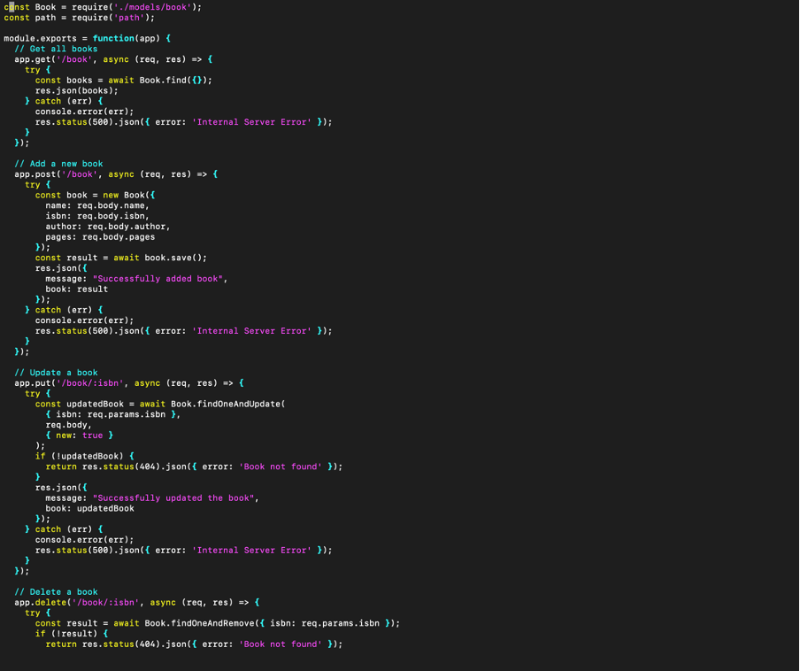

__3.__ __In the ‘apps’ folder, create a folder named models__

```bash
mkdir models && cd models
```
__In models, create a file named book.js__

```bash
vim book.js
```

Copy and paste the code below into book.js

```bash
const mongoose = require('mongoose');

const bookSchema = new mongoose.Schema({
  name: { type: String, required: true },
  isbn: { type: String, required: true, unique: true },
  author: { type: String, required: true },
  pages: { type: Number, required: true }
});

module.exports = mongoose.model('Book', bookSchema);
```
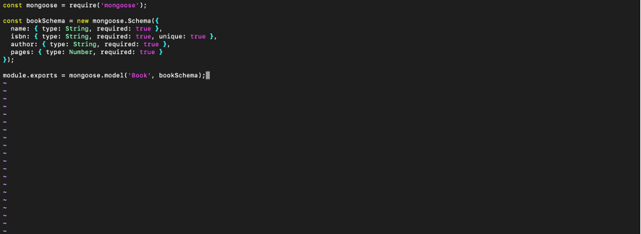


## Step 4 - Access the routes with AngularJS

In this project, AngularJS was used to connect the web page with Express and perform actions on the book register.

__1.__ __Change the directory back to ‘Books’ and create a folder named ‘public’__

```bash
cd ../..

mkdir public && cd public
```
__Add a file named script.js into public folder__

```bash
vim script.js
```
Copy and paste the code below (controller configuration defined) into the script.js file.

```bash
var app = angular.module('myApp', []);

app.controller('myCtrl', function($scope, $http) {
  // Get all books
  function getAllBooks() {
    $http({
      method: 'GET',
      url: '/book'
    }).then(function successCallback(response) {
      $scope.books = response.data;
    }, function errorCallback(response) {
      console.log('Error: ' + response.data);
    });
  }

  // Initial load of books
  getAllBooks();

  // Add a new book
  $scope.add_book = function() {
    var body = {
      name: $scope.Name,
      isbn: $scope.Isbn,
      author: $scope.Author,
      pages: $scope.Pages
    };
    $http({
      method: 'POST',
      url: '/book',
      data: body
    }).then(function successCallback(response) {
      console.log(response.data);
      getAllBooks();  // Refresh the book list
      // Clear the input fields
      $scope.Name = '';
      $scope.Isbn = '';
      $scope.Author = '';
      $scope.Pages = '';
    }, function errorCallback(response) {
      console.log('Error: ' + response.data);
    });
  };

  // Update a book
  $scope.update_book = function(book) {
    var body = {
      name: book.name,
      isbn: book.isbn,
      author: book.author,
      pages: book.pages
    };
    $http({
      method: 'PUT',
      url: '/book/' + book.isbn,
      data: body
    }).then(function successCallback(response) {
      console.log(response.data);
      getAllBooks();  // Refresh the book list
    }, function errorCallback(response) {
      console.log('Error: ' + response.data);
    });
  };

  // Delete a book
  $scope.delete_book = function(isbn) {
    $http({
      method: 'DELETE',
      url: '/book/' + isbn
    }).then(function successCallback(response) {
      console.log(response.data);
      getAllBooks();  // Refresh the book list
    }, function errorCallback(response) {
      console.log('Error: ' + response.data);
    });
  };
});
```
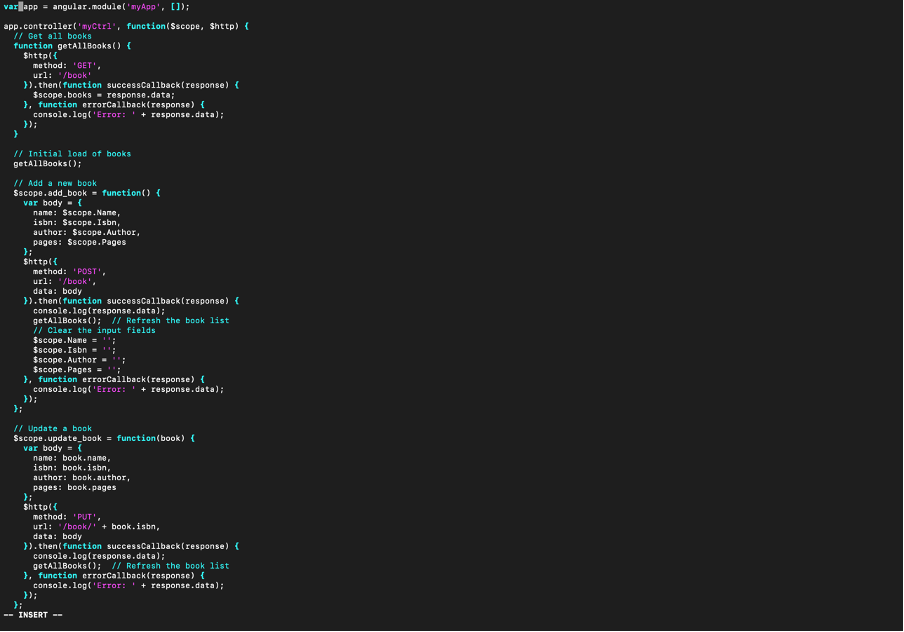


__2.__ __In ‘public’ folder, create a file named index.html__

```bash
vim index.html
```
Copy and paste the code below into index.html file

```bash
<!DOCTYPE html>
<html ng-app="myApp" ng-controller="myCtrl">
<head>
  <script src="https://ajax.googleapis.com/ajax/libs/angularjs/1.6.4/angular.min.js"></script>
  <script src="script.js"></script>
  <style>
    /* Add your custom CSS styles here */
  </style>
</head>
<body>
  <div>
    <table>
      <tr>
        <td>Name:</td>
        <td><input type="text" ng-model="Name"></td>
      </tr>
      <tr>
        <td>Isbn:</td>
        <td><input type="text" ng-model="Isbn"></td>
      </tr>
      <tr>
        <td>Author:</td>
        <td><input type="text" ng-model="Author"></td>
      </tr>
      <tr>
        <td>Pages:</td>
        <td><input type="number" ng-model="Pages"></td>
      </tr>
    </table>
    <button ng-click="add_book()">Add</button>
    <div ng-if="successMessage">{{ successMessage }}</div>
    <div ng-if="errorMessage">{{ errorMessage }}</div>
  </div>
  <hr>
  <div>
    <table>
      <tr>
        <th>Name</th>
        <th>Isbn</th>
        <th>Author</th>
        <th>Page</th>
        <th>Action</th>
      </tr>
      <tr ng-repeat="book in books">
        <td>{{ book.name }}</td>
        <td>{{ book.isbn }}</td>
        <td>{{ book.author }}</td>
        <td>{{ book.pages }}</td>
        <td><button ng-click="del_book(book)">Delete</button></td>
      </tr>
    </table>
  </div>
</body>
</html>
```


__3.__ __Change the directory back up to ‘Books’ and start the server__

```bash
cd ..
```
```bash
node server.js
```
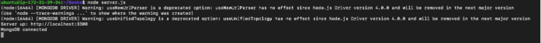

The server is now up and running, Connection to it is via port 3300. A separate Putty or SSH console to test what curl command returns locally can be launched.

The Book Register web application can now be accessed from the internet with a browser using the Public IP address or Public DNS name.

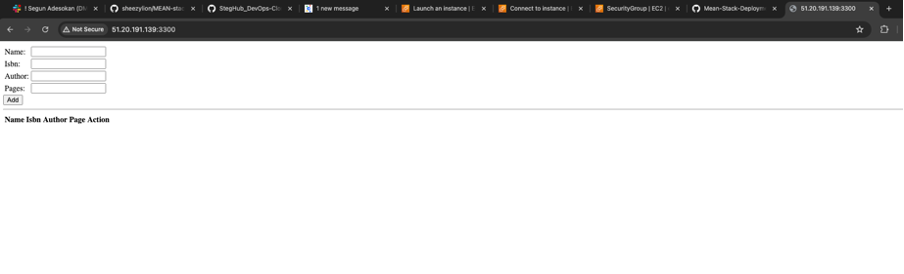

Add more books to the register

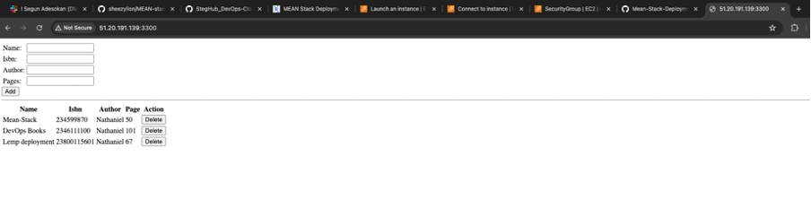


## Conclusion

The MEAN stack—comprising MongoDB, Express.js, AngularJS (or Angular), and Node.js—provides a powerful and cohesive set of technologies for building modern web applications.

Together, these technologies allow developers to use JavaScript throughout the entire development process, from front-end to back-end, promoting a unified and streamlined development workflow.

## Congratulations on making it this far 🥇


